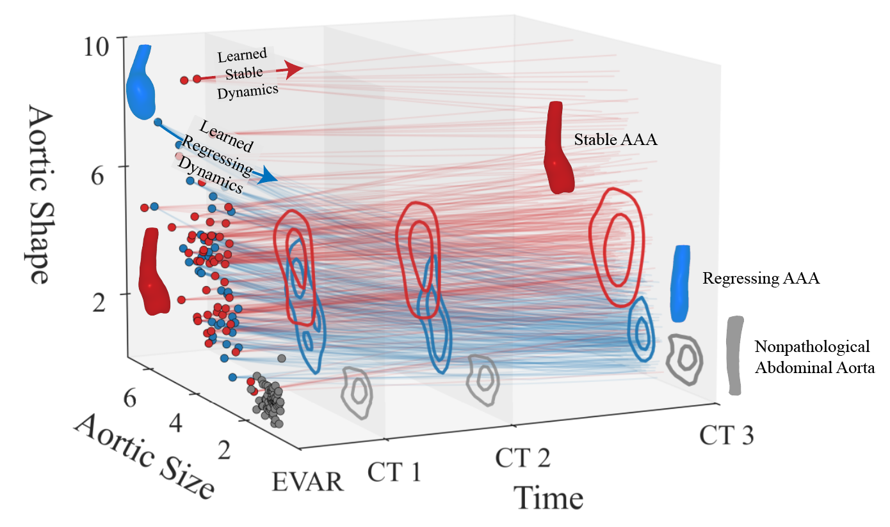

# Dynamic Temporal Modeling of AAA Morphology with Z-SINDy

Abdominal aortic aneurysm (AAA) is characterized by a localized enlargement of the aorta with risk of rupture. 
Endovascular aneurysm repair (EVAR) alters sac morphology in ways not captured by size alone and is typically observed only at sparse follow-up times.
We present a physically interpretable, noise-aware framework that models postoperative remodeling dynamics in a low-dimensional state space defined by normalized sac surface area $(\widetilde{A})$ and the normalized fluctuation in integrated Gaussian curvature $(\widetilde{\delta K})$. Using Sparse Identification of Nonlinear Dynamics (Z-SINDy), we infer ordinary differential equations governing the temporal evolution of $(\widetilde{A}, \widetilde{\delta K})$ for clinically defined cohorts of regressing and stable sacs.
The learned models yield class-specific flow fields and fixed points that summarize long-term behavior: regressing sacs converge toward a low-size/low-shape attractor, whereas stable sacs maintain near-constant size with persistently elevated shape. Embedding these dynamics in a Bayesian decision framework enables complementary static (coordinate-based) and dynamic (derivative-based) classifiers.
Across cohorts, the dynamic classifier separates outcomes earlier and with higher confidence, demonstrating that rates of change become informative before static anatomical distributions separate. Stress tests injecting spatial noise and imposing realistic, irregular follow-up cadences quantify performance degradation and sensitivity to measurement fidelity and scheduling.
Together, these results provide a principled route from interpretable geometric features to individualized, probabilistic forecasts of AAA remodeling post-EVAR and offer actionable guidance for surveillance design.

<p align="center">
  
</p>

> **Manuscript:**  
> *Dynamic Temporal Modeling of Abdominal Aortic
Aneurysm Morphology with Z–SINDy*

## Repository Structure

```text
.
├── data/              # Nonpathological, U.Chicago, and ErasmusU. datasets
├── notebooks/         # Manuscript analysis
├── figs/              # Manuscript figures
├── pyfiles/           # pyfiles
├── ga.png             # Graphical abstract
└── README.md
